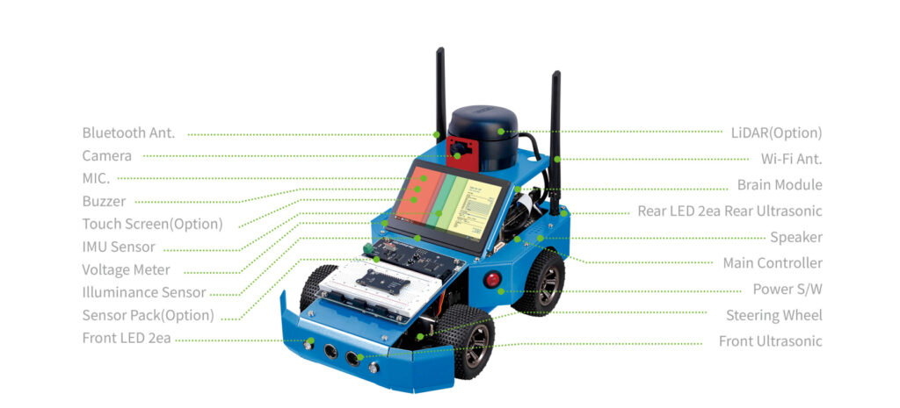
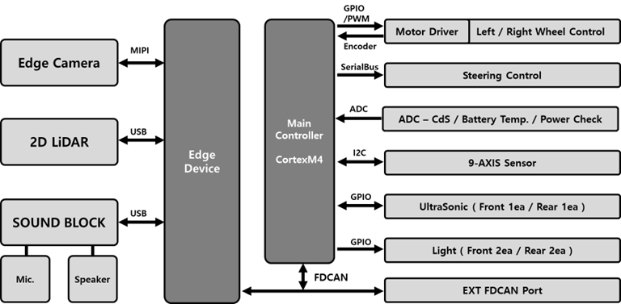
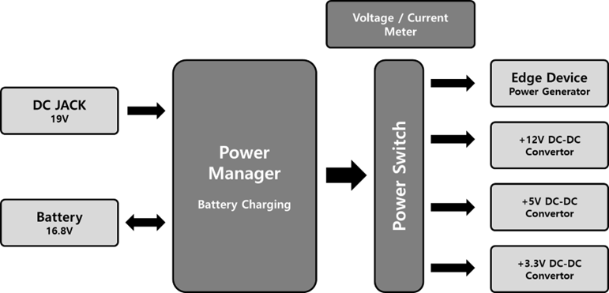
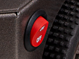
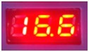
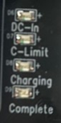
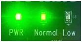
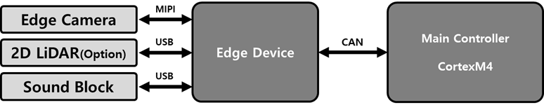
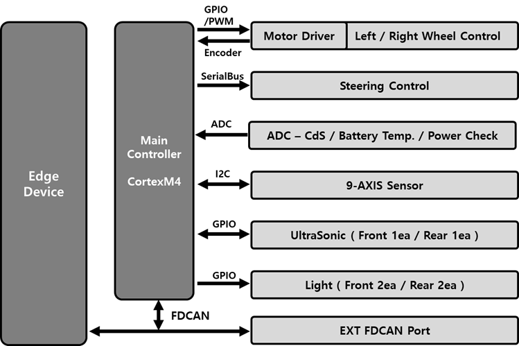

# Autocar3 G 

AutoCar3 G(이하 AutoCar)는 사용자의 직접 제어 없이, 엣지 디바이스를 메인 프로세서로 활용하여 자율주행 기능을 수행하도록 설계된 교육·연구용 플랫폼입니다. 엣지 디바이스는 Nvidia Jetson 기반의 AI 모듈이 탑재되어 있어 영상처리·센서융합·딥러닝 기반 모델 실행 등 다양한 인공지능 기능을 안정적으로 구현할 수 있습니다.

한백전자가 제공하는 학습용 라이브러리와 실습 예제를 통해 인공지능 기초부터 실제 차량 제어까지 자연스럽게 학습할 수 있으며, 카메라·마이크·9축 센서·구동 모터·스피커 등 다양한 하드웨어를 활용해 사용자가 직접 다양한 AI 아이디어를 구현할 수 있습니다.

AutoCar의 전원을 연결한 뒤 스위치를 켜면 약 1분간 시스템 점검과 Jetson 모듈 부팅이 진행됩니다. AutoCar는 모니터가 기본 제공되지 않기 때문에, 개발을 위해서는 네트워크 연결 후 SSH 또는 NoMachine과 같은 원격 접속 프로그램을 이용해야 합니다.

## Layout

AutoCar의 기본 구성은 다음과 같습니다. LiDAR, Touch Screen, Sensor Pack은 옵션이므로 현재 제품 구성에 따라 포함되어 있지 않을 수 있습니다.

## Block Diagram

아래 그림은 AutoCar의 전체 블록 구성도로 핵심은 엣지 디바이스와 메인 컨트롤러의 역할이며 이들은 FDCAN(Flexible Data-rate CAN protocol)을 통해 상호 연결됩니다. 

Cortex-M4 기반의 Main Controller는 차량에 장착된 초음파 센서, 9축 센서, 모터 컨트롤러 등 주변 장치를 제어합니다. 다만 차량 주행 시 ‘어떻게 움직일지’에 대한 의사결정은 엣지 디바이스에서 수행하며, Main Controller는 이를 CAN 통신을 통해 수신하여 실제 구동을 수행합니다.

또한 외부 장비와의 연동을 위해 EXT CAN Port가 제공되어 확장 제어 및 모니터링이 가능합니다.

## Hardware

### Power Block

아래 그림은 AutoCar의 전원 구성 블록 다이어그램입니다.

AutoCar는 Power Manager 블록을 통해 DC JACK으로 입력되는 DC 어댑터 전원을 배터리 충전에 사용하며, 동시에 메인 전원 공급에도 활용합니다. DC 입력이 없을 경우에는 배터리를 통해 장비가 구동되도록 자동 전환됩니다.

Power Switch는 배터리 또는 DC 입력 전압을 메인 시스템으로 전달하는 역할을 담당하며, Power Manager에서 공급되는 전압·전류는 Voltage/Current Meter를 통해 확인할 수 있습니다.

AutoCar에는 공칭 전압 +14.8V, 최대 전압 +16.8V의 리튬 배터리가 사용됩니다. 전원 스위치는 아래 사진과 같이 위쪽 방향으로 올리면 ON, 아래 방향으로 내리면 OFF입니다.

전원이 켜지면 현재 배터리 전압은 다음과 같이 표시됩니다.

배터리 충전은 전원 상태와 관계없이 +19V DC 어댑터를 DC JACK에 연결하는 즉시 시작됩니다. 충전 LED 표시 내용은 아래와 같습니다.
- Complete (녹색 LED): 충전 완료
- Charging (적색 LED): 충전 중
- DC IN: 어댑터 연결 여부 표시
- Current Limit: 과전류 발생 시 점등

Main Controller는 배터리 전압 정보도 모니터링하며, 전압 상태에 따라 다음과 같은 LED로 알려줍니다.
- Normal: 정상 사용 가능
- Low: 배터리 부족 — 충전 필요

### Edge Device Block

AutoCar는 고성능 엣지 디바이스(예: Jetson)를 차량 제어의 핵심으로 사용합니다.

엣지 디바이스에는 카메라가 MIPI 인터페이스로 연결되며, 음향 관련 장치는 USB 기반 Sound Block을 통해 연결됩니다. Main Controller와는 CAN 통신으로 연동되며, 초음파·9축 IMU 등의 센서 데이터와 실시간 영상 데이터를 활용하여 차량 움직임을 결정합니다.

### Main Controller Block

Main Controller는 센서 데이터 운용 및 모터 제어를 담당하는 차량 내부 제어 시스템입니다. 연산 및 판단은 엣지 디바이스가 수행하며, Main Controller는 해당 명령을 실제 구동으로 변환하는 역할을 맡습니다.

구성 요소는 다음과 같습니다.
- 전/후면 초음파 센서: 거리 측정 및 장애물 감지
- 9축 센서(IMU): 자세 및 움직임 감지
- 전/후면 LED: 주행 관련 표시
- Motor Driver: 전진/후진 제어
- Steering Servo: 조향 제어
- 배터리 전압·온도 모니터링: 안전 보호 기능

이 모든 데이터는 CAN 통신을 통해 엣지 디바이스로 전달되며, 엣지 디바이스의 판단에 따라 모터 등이 제어됩니다.