# 개발환경 구성

## 유선 네트워크 연결

AutoCar는 기본적으로 모니터나 키보드가 없기 때문에, PC를 이용해 설정을 진행해야 합니다. 

AutoCar의 이더넷 IP는 192.168.101.101로 사전에 부여되어 있으므로, PC와 AutoCar는 이더넷 케이블을 통해 유선 네트워크로 연결하며,아래와 같은 과정으로 PC 측에서 새 IP 주소를 설정합니다.   

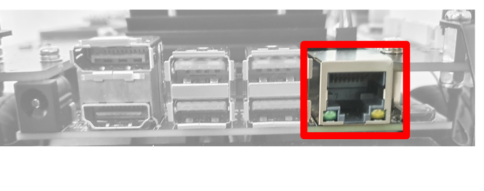

**PC 이더넷 IP 설정 절차**

1. 명령 프롬프트 실행 후 **ncpa.cpl** 입력 후 \<ENTER>

    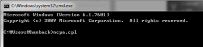

2. 이더넷 장치(이름은 PC마다 다를 수 있음)를 마우스 우클릭 후 **속성** 선택. 

    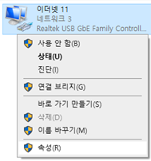

3. **인터넷 프로토콜 버전 4(TCP/IPv4)** 더블클릭

    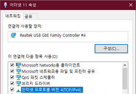

4. IP 주소 수동 입력 
   - IP 주소: 192.168.101.102
   - 서브넷 마스크: 255.255.255.0

    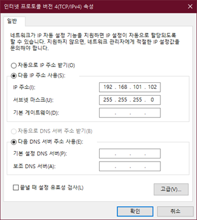

5. **확인** 버튼을 눌러 종료 

## 개발 환경

AudoCar의 엣지 디바이스는 리눅스 기반이며, 인공지능 구현을 위해 Python을 기본 개발 언어로 사용합니다.

### Visual Studio Code

VS Code는 무료로 제공되는 범용 IDE로, 확장 기능 설치를 통해 Python 개발 환경을 구성할 수 있습니다. AutoCar 개발은 VS Code의 SSH 원격 개발 기능을 기반으로 진행합니다.

**VSCode 설치**

VSCode 편집기를 IDE로 사용하기 위해선 다양한 확장 기능을 설치해주고 직접 설정해 주어야 하는 불편함이 있습니다. 한백전자에서는 이러한 불편함을 해소시키기 위해 Windows에서 VSCode 및 pwsh 등 여러 편리한 개발환경들을 자동으로 설치해주는 스크립트를 제공합니다. 설치하는 방법은 다음과 같습니다.

아래 링크에 접속한 후 cmd 파일을 다운로드합니다.

- https://raw.githubusercontent.com/hanback-lab/devenv-setup/refs/heads/main/devenv-setup.exe

파일을 다운로드 받은 후 탐색기로 다운로드한 위치로 이동한 후 `devenv-setup.exe` 파일을 실행합니다. 이 후 아래의 사진과 같이 프로그램이 실행됩니다. `Installation Path` 입력 칸에는 VSCode가 설치될 경로를, `Python Version` 입력 칸에는 설치할 파이썬 버전을 입력합니다. 


입력 완료 후 `Install` 버튼을 누르면 VSCode 및 필요한 패키지가 설치됩니다. 설치가 완료되면 다음 경로로 이동합니다. 

```sh
C:\VSCode\
```

폴더 내부에 launcher.exe 파일을 실행하여 VSCode를 실행합니다. 이 launcher 프로그램은 실행 시 VSCode 관련 패키지의 버전 확인 및 자동 업데이트 기능을 실행과 동시에 진행합니다.

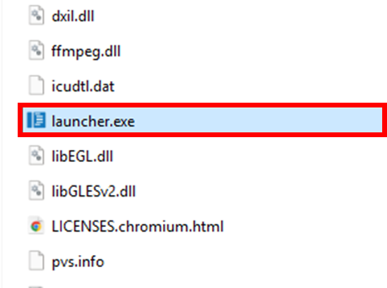

**AutoCar 원격 접속 설정**

아래 사진과 같이 설치된 VSCode 좌측편에는 `Remote Explorer` 아이콘이 배치되어 있습니다. 이 곳에 AutoCar 원격 접속 정보를 한 번만 등록하면 이를 바탕으로 AutoCar에 접속할 수 있어 편리합니다. 

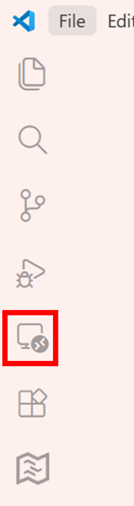

1. Command Palette(\<Ctrl>\<Shift>p)를 띄우고 ‘Remote-SSH: Add New SSH Host...’입력 

    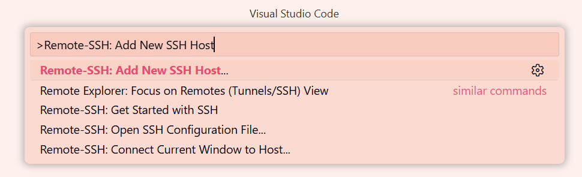

2. 연결 입력창에 ID@IP 형식으로 입력, ex) soda@192.168.101.101 

    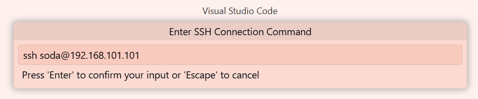

3. 저장 경로는 첫 번째 항목인 C:\Users\<login>\\.ssh\config 선택

    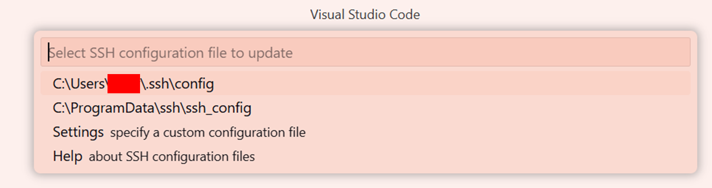

**AudoCar 원격 접속**

PC에서 VS Code를 통해 AutoCar에 원격 접속한 상태에서 파이썬 기반 자율주행 응용 프로그램을 개발하려면, AutoCar 내부에 VS Code Server가 설치되어 있어야 합니다. VS Code Server는 PC에서 실행되는 VS Code의 Python 확장과 연동되어, 사용자가 마치 로컬 PC에서 개발하듯이 AutoCar 내부에서 프로그램 작성·실행·디버깅을 수행할 수 있도록 환경을 제공합니다.

VS Code Server를 AutoCar에 설치하는 절차는 다음과 같습니다. (※ 이 과정에서 PC는 반드시 인터넷에 연결되어 있어야 합니다.)

1. VS Code 왼쪽 사이드바에서 Remote Explorer를 선택합니다.
2. 목록에서 '192.168.101.101' 항목을 마우스 오른쪽 버튼으로 클릭하고 Connect to Host in Current Window를 선택합니다.

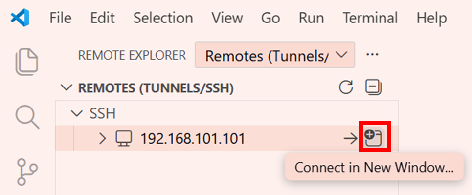

3. Windows 보안 경고 창이 나타나면 액세스 허용을 선택합니다.

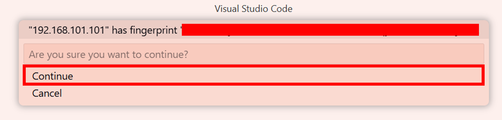

4. “Select the platform of the remote host 192.168.101.101” 메시지가 나타나면 Linux를 선택합니다.
5. “Enter password for soda@192.168.101.101” 메시지가 표시되면 soda를 입력합니다.

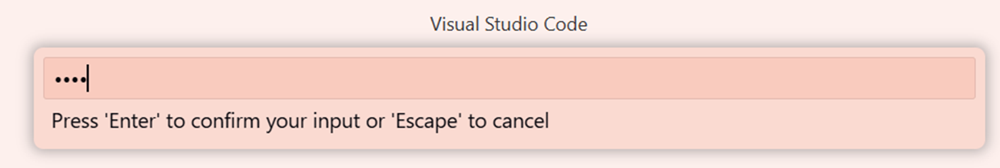

6. 이후 비밀번호 입력창이 다시 표시될 경우 동일하게 soda를 입력합니다.
7. 최초 접속 시 VS Code Server가 인터넷을 통해 다운로드되어 AutoCar에 자동 설치됩니다. 네트워크 상황에 따라 설치에는 수 분이 소요될 수 있습니다.
8. AutoCar 측 VS Code Server 설치가 완료되면, AutoCar에 Python 확장을 설치합니다.
9. 이때 AutoCar에 원격 접속된 상태여야 합니다.
10. VS Code 왼쪽 사이드바에서 Extensions (\<Ctrl>+\<Shift>+X) 을 선택합니다.
11. ‘Python’을 검색하고, **Install in SSH: 192.168.101.101**를 선택하여 설치합니다.

**작업 공간 및 작업 파일 생성**

Explorer의 도구 모음에서 New Folder를 선택하여 새 폴더를 생성합니다. 이 폴더가 이후 작성할 코드와 자료를 저장하는 작업 공간(Workspace) 역할을 합니다. 작업 공간이 준비되면, New File을 선택하여 새 파일을 생성하고 파일이름.py 형태로 저장하면 파이썬 파일이 만들어집니다.

파이썬 코드를 편집창에 작성한 뒤, 상단 도구 모음에서 Run Python File을 선택하면 터미널이 자동으로 열리며 작성한 코드가 실행됩니다.

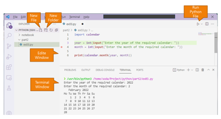

**디버깅**

디버깅(Debugging)은 실행 중인 프로그램의 흐름을 단계별로 분석하고 오류를 추적하기 위한 과정입니다. 이를 위해 사용하는 대표적인 기능이 **중단점(Breakpoint)** 입니다. 중단점은 프로그램이 해당 위치까지 실행된 후 일시적으로 멈추도록 설정하는 지점으로, 특정 변수 값이나 실행 흐름을 확인할 때 유용합니다.

중단점은 편집기 왼쪽 여백을 클릭하거나 \<F9> 키를 눌러 설정·해제할 수 있으며, 원하는 모든 코드 줄에 지정할 수 있습니다.

디버깅을 시작하려면 편집기 상단의 도구 모음에서 Debug Python File을 선택하거나, 메뉴에서 Run > Start Debugging(F5) 을 실행합니다. 디버깅이 시작되면 화면 상단에 디버그 도구 모음이 표시되며, 다음 기능을 활용할 수 있습니다.

- 계속/일시중지: F5
- 한 줄 실행(Step Over): F10
- 함수 내부로 진입(Step Into): F11
- 함수 밖으로 나오기(Step Out): Shift + F11
- 디버깅 다시 시작: Ctrl + Shift + F5
- 디버깅 중지: Shift + F5

## 무선 네트워크 연결 

무선 설정을 위해서는 AutoCar를 공유기에 연결한 후 부여된 IP 주소를 파악하기 위해 최초 1회 유선 연결이 필요합니다. 따라서 반드시 앞서 진행한 "PC 이더넷 IP 설정"을 완료된 후 인터넷 표준 원격 터미널 서비스인 SSH를 통해 AutoCar의 무선 네트워크 설정을 진행합니다.

**공유기 연결**

전 과정에서 VSCode 원격 접속 후, 아래 사진과 같이 터미널을 열어 다음 명령으로 주변 Wi-Fi 공유기 목록을 확인합니다. 

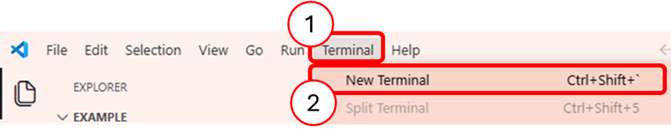

```sh
sudo nmcli device wifi list
```

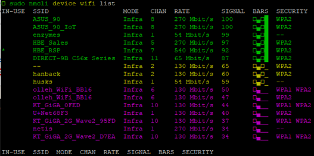

만약 검색되지 않으면 rescan 옵션으로 다시 실행합니다.

```sh
sudo nmcli device wifi rescan
```

공유기 연결은 connect 옵션을 사용합니다. 이때 공유기 이름에 해당하는 SSID와 비밀번호로가 필요합니니다. (비밀번호는 공유기 관리자에게 문의하세요.) 

```sh
sudo nmcli device wifi connect <SSID> password <PASSWORD>
```

비밀번호가 없는 개방형 공유기라면 password 옵션은 생략합니다.

연결 후, 다음과 같이 AutoCar에 부여된 IP를 확인하는데, 앞으로 PC에서 AutoCar로 무선 접속할 때는 이 IP를 이용합니다.

```sh
ifconfig wlan0
```

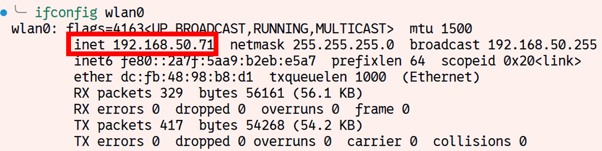