# Pop plus

AutoCar를 직접 제어하는 가장 기본적인 방식은 MCU와 CAN 통신을 수행하거나, MIPI로 연결된 카메라 데이터를 직접 수집하여 처리하는 것입니다. 그러나 이러한 저수준 기능을 모두 Python 코드로 구현하려면 많은 시간과 복잡한 개발 과정이 필요합니다.

이를 해결하기 위해 제공되는 것이 `Pop plus` 라이브러리입니다. `Pop plus`는 AutoCar 제어를 위해 필요한 하드웨어 동작과 통신 과정을 고수준 API로 추상화하여, 사용자가 핵심 로직 개발에만 집중할 수 있도록 설계된 라이브러리입니다. 복잡한 제어 흐름을 단순한 함수 호출로 수행할 수 있어 개발 효율을 크게 높여줍니다.

또한 `Pop plus`는 MQTT 기반으로 동작합니다. MQTT는 IoT 환경에서 널리 사용되는 초경량 메시징 프로토콜로, AutoCar 내부에서는 항상 MQTT–CAN Bridge 서버가 실행되고 있습니다. 이를 통해 같은 네트워크에 연결되어 있기만 하면, Edge 디바이스에 SSH 접속 없이도 AutoCar를 원격으로 제어할 수 있으며, 빠르고 가벼운 통신 환경을 제공합니다. 


참고로, 카메라 데이터는 MQTT 서버가 아닌 별도의 카메라 서버를 통해 전송됩니다. 이는 영상 스트리밍 특성상 더 안정적이고 빠른 전송이 필요하기 때문입니다.

MQTT에 대해 보다 더 자세한 설명은 부록(etc)의 `A. MQTT` 문서를 참고해주시길 바랍니다.

## 사전 준비

### 라이브러리 설치

AutoCar용 `Pop plus` 라이브러리는 PyPI에 등록되어 있으며, 아래와 같이 터미널에 pip 명령을 입력하여 설치할 수 있습니다. 아래 명령어 실행 시 Pop plus 라이브러리 뿐만 아닌 실습에 필요한 라이브러리까지 모두 자동으로 설치됩니다. 다만 AutoCar 장비에는 해당 라이브러리가 기본적으로 사전 설치되어 있으므로, 별도의 설치 과정 없이 바로 사용할 수 있습니다. 

```sh
pip install autocar3g
```

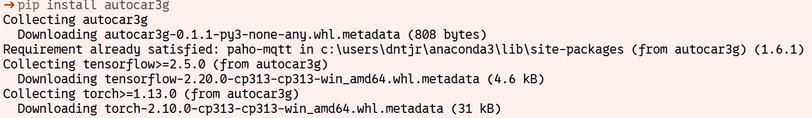

Pop plus 라이브러리는 다음과 같은 의존성을 지니고 있습니다. 이미 설치가 되어 있다면 무시되며, 설치를 하지 않을 경우 자동으로 설치됩니다. 

- paho-mqtt
- opencv-python>=4.1.0.25
- tensorflow>=2.5.0
- torch>=1.13.0
- ultralytics

### product

product 파일 생성에 앞서 AutoCar3G (이하 Autocar) 에 작성되어 있는 내용을 확인해 보겠습니다.
네트워크 연결을 먼저 진행한 후 아래 내용을 진행합니다.

1. VSCode 원격 접속
    - 1-2. Config the environment 문서를 참고하여 장비에 원격 접속 합니다. 

2. 다음 명령을 통한 명칭 확인
    - 다음 명령을 입력하여 출력되는 내용중 INSITUTION_NAME 을 확인하여 작성중인 product 파일에 적용합니다.

```sh
cat /etc/product 

ex) 
BROKER_DOMAIN=127.0.0.1
CAMERA_DOMAIN=127.0.0.1
DEVICE_NAME=TB
DEV_NUM=01
INSITUTION_NAME=HBE
```

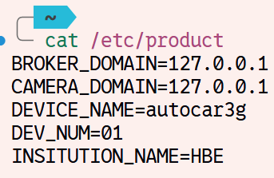

출력되는 product 파일의 내용은 AutoCar 내부에 저장된 내용이며 출력된 내용의 정보는 다음과 같습니다.

- BROKER_DOMAIN : 접속할 브로커의 주소 입니다.
    - AutoCar는 자체 설치된 브로커를 활용합니다. 따라서 IP 주소가 '127.0.0.1' 로 설정되어 있습니다.
    - **외부에서 접속하는경우에는 AutoCar 의 무선 IP를 입력합니다.**
- CAMERA_DOMAIN : AutoCar 의 Camera 서버 주소 입니다.
    - **외부에서 접속하는경우에는 AutoCar 의 무선 IP를 입력합니다.**
- DEVICE_NAME : 장비의 이름으로 AutoCar는 'autocar3g' 으로 설정되어 있습니다.
- DEV_NUM : 장치의 고유 번호로 여러개의 장비가 존재하는 경우에는 이 번호를 중복되지 않게 설정해야 합니다.
- INSITUTION_NAME : 학교 또는 기관의 명칭을 고유 키워드로 활용합니다.

이 정보를 기반으로 product 파일을 **자신의 PC의 작업공간** 에 파일을 생성합니다.

파일생성에 앞서 작업공간을 지정합니다. VSCode 에서는 File -> Open Folder 선택 후 원하는 폴더를 지정합니다. 


작업공간을 지정했다면 다음과 같이 **PC에서 접속하기위한 product 파일** 을 작성합니다.

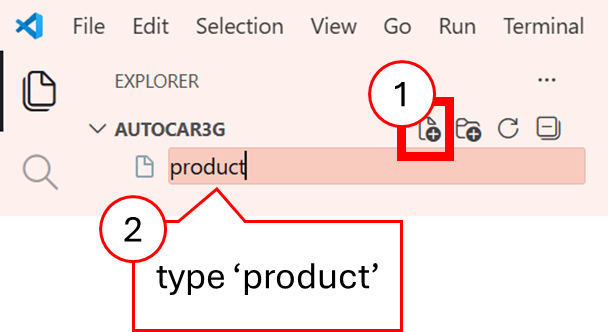

```
BROKER_DOMAIN=<WLAN IP>
CAMERA_DOMAIN=<WLAN IP>
DEVICE_NAME=autocar3g
DEV_NUM=01
INSITUTION_NAME=HBE
```

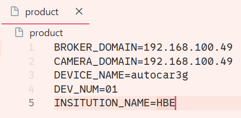

이 후 실습하는 모든 내용들은 사용자 PC에서 진행됩니다.

## 차량 제어

차량을 제어하는 주요 변수는 다음과 같습니다.

- steering : 값을 -1 ~ 1 사이값으로 지정하면 차량의 앞바퀴를 좌/우로 조향
- throttle : 값을 -99~99 사이값으로 지정하여 차량의 속력을 제어

먼저, pop plus에서 driving 라이브러리를 불러오고 Driving 클래스를 생성합니다. 또, 코드 진행에 딜레이를 주고 관찰하기 위해 `time` 모듈도 불러옵니다.

```python
import time
from autocar3g.driving import Driving

car = Driving()
```

### 조향

다음과 같이 AutoCar의 steering 속성 값을 입력하면 차량을 좌우로 조향할 수 있습니다.

```python
car.steering = -1
time.sleep(1)
car.steering = 1
time.sleep(1)
```

### 전후진

다음과 같이 AutoCar의 throttle 속성 값을 입력하면 차량을 전진 혹은 후진할 수 있습니다.

```python
car.throttle=10
time.sleep(2)

car.throttle=-10
time.sleep(2)

car.stop()
time.sleep(1)
```

### 엔코더

pop plus 라이브러리의 Encoder 클래스를 활용하면 모터가 전진 또는 후진 동작을 수행하는동안 Encoder 데이터를 수신할 수 있습니다. Encoder 클래스의 `read` 함수를 통해 엔코더 값을 읽을 수 있으며, 함수의 반환값은 순서대로 좌, 우측 모터의 데이터를 의미합니다 

```python
from autocar3g.driving import Driving
from autocar3g.Encoder import Encoder
import time 

car = Driving()
enc = Encoder()
enc.callback(enc_callback)

for i in range(90):
    if i%10 == 0:
         car.throttle = i+10
    time.sleep(1)
    print(enc.read())

car.throttle = 0
```

```
[출력]
(199, 195)
(200, 195)
(200, 195) 
…
(574, 563)
(573, 562)
(573, 563) 
```

### 전후방 LED

pop plus 라이브러리의 Led 클래스를 활용하면 전후방 LED를 점등 또는 소등할 수 있습니다. Led 클래스의 메소드는 다음과 같습니다. 

- onoff(front, rear): 전후방 LED를 on 혹은 off
  -	front : 전방 LED 제어, 값이 0일 때 소등하며, 1일 때 점등
  -	rear : 후방 LED 제어, 값이 0일 때 소등하며, 1일 때 점등

onoff() 메소드의 파라미터 중 첫번째는 전방 LED, 두번째는 후방 LED를 제어합니다. 파라미터의 값이 0일 때 소등하며, 1일 때 점등합니다. 다음 코드를 실행하면 전방, 후방의 순서대로 LED가 켜졌다가 한번에 모든 LED가 꺼지는 것을 확인할 수 있습니다.

```python
from autocar3g.Led import Led 
import time 

led = Led()

led.onoff(1,0)
time.sleep(1)
led.onoff(1,1)
time.sleep(1)
led.onoff(0,1)
time.sleep(1)
led.onoff(0,0)
```

## 초음파 센서

Ultrasonic 클래스의 `read()` 메소드를 활용하면 초음파 센서의 거리 값(cm)을 읽을 수 있습니다. 앞과 뒤에 각각 두개의 센서가 있고 최소 10cm, 최대 180cm의 거리를 감지할 수 있습니다. 

```python
from autocar3g.Ultrasonic import Ultrasonic
import time 

ultra = Ultrasonic()
for _ in range(10):
    print(ultra.read())
    time.sleep(0.5)
```

```
[출력]
(84, 95)
(84, 95) 
…
(84, 16)
(84, 16)
```

## 9축 센서

AutoCar에 탑재된 9축 센서를 사용하여 가속도, 지자기, 자이로, 오일러 각을 알 수 있습니다. 

pop plus 라이브러리에서 9축 센서 데이터를 수신할 때는 Imu 클래스를 활용하며 Imu 클래스에서 활용 가능한 메소드는 다음과 같습니다.

- accel() : 가속도 센서값 반환, (x,y,z) 형태로 반환 
- magnetic() : 지자기 센서값 반환, (x,y,z) 형태로 반환 
- gyro() : 자이로 센서값 반환, (x,y,z) 형태로 반환 
- euler() : 오일러 센서값 반환, (x,y,z) 형태로 반환 
- quat() : 쿼터니언 센서값 반환, (w,x,y,z) 형태로 반환 

### 가속도

accel() 메소드를 사용하면 9축 센서의 가속도 값을 읽을 수 있습니다. 

```python
from autocar3g.Imu import Imu
import time 
	
imu = Imu()
	
for _ in range(20):
    print(imu.accel())
    time.sleep(0.1)
```

```
[출력]
(0.01123046875, 0.93359375, -0.3369140625)
(0.01025390625, 0.9326171875, -0.33154296875)
…
(0.01025390625, 0.9326171875, -0.33349609375)
(0.0107421875, 0.93310546875, -0.33154296875)
```

가속도 센서는 직선 방향으로 단위 시간에 대한 속도의 증감비를 나타내는 센서로써 다음의 법칙이 적용됩니다. 3축 가속도 센서는 센서가 3차원에서 움직일 때 x, y, z축 방향의 가속도를 측정합니다.

1. 뉴턴의 제2 법칙(가속도 법칙): $F = AM$
2. 휴크의 법칙(용수철 법칙): $F = kX$
3. 변형도가 작은 범위에서 탄성체의 응력과 변형도에 대한 공식
4. $A = (kX) / M$
5. $k$: 스프링 상수
6. $M$: 스프링에 달린 물체의 질량
7. 가속도는 스프링이 늘어난 길이에 정비례


가속도 센서로 각도 계산(가속도 센서 보정)을 할 때는 정지한 상태에서는 중력 가속도를 감지하므로 z축 방향으로 -g만큼의 값을 출력합니다. (중력 가속도는 9.80665m/s^2) 센서의 초기 출력이 모두 0일 때, 물체를 y축 방향으로 45도 기울이면 z축 방향과 x축 방향으로 동일한 가속도가 측정됩니다. 중력 방향으로 g가 측정되어야 하므로 0.707g만큼 z축과 x축 방향으로 출력되며 결과적으로는 z축과 x축 값의 비율을 arctan에 넣으면 결괏값이 45도 즉, 기울어진 값이 됩니다.

- $\frac{y}{x} = tan(angle)$
- $angle=arctan(\frac{y}{x})$

만약 정지된 상태에서 물체가 움직이기 시작하면 그때 측정되는 값은 기울기가 아닌 탄성체의 진동에 의해 출력값이 불규칙하게 변한 값입니다. 이는 충격 감지용으로 사용할 수 있습니다.

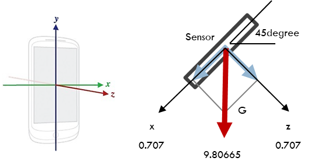

### 지자기

accel() 메소드와 비슷하게 magnetic() 메소드를 사용하면 9축 센서의 지자기 값을 읽을 수 있습니다. 

```python
from autocar3g.Imu import Imu
import time 

imu = Imu()

for _ in range(20):
    print(imu.magnetic())
    time.sleep(0.1)
```

```
[출력]
(675, -5391, -4180)
(699, -5392, -4171)
…
(697, -5389, -4141)
(686, -5393, -4133)
```

자기장은 방향과 크기를 갖는 벡터 물리량으로 움직이는 전하(전류) 또는 전자의 스핀 현상에 의해 발생하며 자기 저항 효과 또는 홀 효과에 의해 변하는 물질의 전기 전도성을 이용합니다.

- 자기 저항 효과: 물체에 자기장이 인가되면 물체의 저항값이 변함
- 홀 효과: 자기장 속에 도체를 놓고 자기장에 직각 방향으로 전류를 흘리면 자기장과 전류에 수직 방향으로 전위차 발생

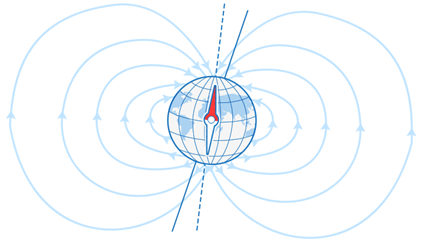

3축 지자기 센서는 센서가 3차원에서 움직일 때 x, y, z축 방향으로 자기장의 크기 또는 자기력선의 크기와 방향을 측정합니다. 자기장 (Earth's magnetic field) 자체를 검출하는 용도보다는 자기장의 변화에 초점을 맞추어 사용되며 자이로 센서에 자기장의 변화를 제공해 오차를 보정하도록 합니다.

자북은 지자기 센서가 인식한 북쪽으로 북극점에서 조금 어긋나 있습니다. 기울기를 고려하지 않으면 X축, Y축만 사용(수평 회전)하며 주위 자장의 영향이 없는 이상적인 경우, 출력 분포도의 원 중심(Px, Py)는 0입니다.

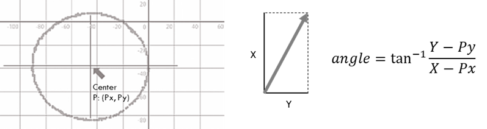

실제 주위 자장의 영향으로 중심이 어긋나기 때문에 원의 중심을 0으로 이동시켜야 하며 자북에서의 각도 계산식은 다음과 같습니다.

$$angle = tan^{-1} \times \frac{(Y-Py)}{(X-Py)}$$

지자기 센서를 기울이면 가속도 센서의 3축 값과 조합해 정확한 방위로 보정해야 합니다.

### 자이로

9축 센서의 자이로 값을 읽을 때는 gyro() 메소드를 사용합니다.

```python
from autocar3g.Imu import Imu
import time 

imu = Imu()
	
for _ in range(20):
 	  print(imu.gyro())
     time.sleep(0.1)
```

```
[출력]
(-1.3427734375, -0.42724609375, -0.06103515625)
(1.0986328125, 0.30517578125, 0.1220703125)
…
(0.06103515625, 0.0, 0.0)
(-0.1220703125, 0.0, 0.0)
```

자이로 센서는 코리올리 힘(Coriolis Force)을 전기적 신호로 변환하여 사용하는데, 이는 물체의 속도에 비례하여 운동 방향으로 수직인 힘입니다. 팽이가 회전할 때 회전축은 항상 지면과 수직 방향 유지하며 자이로 센서는 이 축을 이용해 물체의 기울기를 측정합니다.

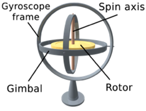

3축 자이로 센서는 센서가 3차원에서 움직일 때 x, y, z축 방향으로 시간당 회전하는 각속도를 이용해 각도를 계산합니다.

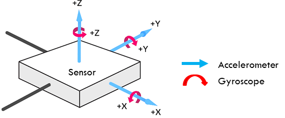

정지한 상태에서 각속도는 0도/sec, 10초 동안 45도 기울어지면 평균 각속도는 4.5도/sec, 기울어진 후 멈춰서 45도를 유지하면 각속도는 0도/sec이며 각속도에서 기울어진 각도를 계산하려면 전체 시간만큼 적분이 필요합니다. 

측정값은 잡음, 온도 변화 등으로 오류가 발생할 수 있으며 적분 과정에서 오류가 누적되면 시간이 지날수록 측정값의 오차도 커지며 지자기 센서를 통해 보정이 가능합니다.

### 오일러 각과 쿼터니움

오일러 각이란 물체가 놓인 방향을 3차원 공간에 표시하기 위해 레온하르트 오일러가 도입한 3개의 각도를 말합니다. 아래 그림에서 볼 수 있는 3개의 각도 중 ψ는 x축을 중심으로 회전한 각도를 의미하며, φ는 y축, θ는 z축을 중심으로 회전한 각도를 의미합니다.

세 축을 중심으로 하는 순차적 회전을 통한 매우 직관적인 표현법으로 보간과 반복에 적합하지 않아 주로 결과의 신속한 시각화를 위해 사용됩니다. 주어진 3차원 공간 좌표계(x, y, z)와 이를 회전시킨 좌표계(X, Y, Z) 사이 강체 방향 (α, β, γ)의 관계는 다음과 같습니다.

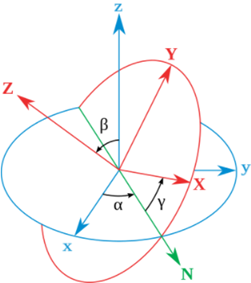

- $\alpha$ (또는 $\psi$) : z-축을 회전축으로 하여 회전된 x-y 좌표축의 각도
- $\beta$ (또는 $\theta$) : 회전된 x-축을 회전축으로 하여 회전된 z-y 좌표축의 각도
- $\gamma$ (또는 $\phi$) : 위에서 회전된z-축을 회전축으로 하여 회전된 X-Y 좌표축의 각도

오일러 각의 범위는 다음과 같습니다.

- $\alpha , \gamma$ : 이상적인 상황에서 $2\pi$ 라디안까지
- $\beta : -\pi/2 \sim \pi/2$ 라디안으로 제한되며 이를 짐벌 락(gimbal lock)이라 함

오일러 각에는 짐벌락이라는 치명적인 문제가 존재합니다. x, y, z 축을 가진 객체가 존재할 때 x축을 90도 회전한 후 y축으로 90도 회전하면 x축과 z축이 겹쳐 한 축에 대해서는 계산 불가능한 상태가 발생하는데 이를 짐벌락이라고 합니다. 

이는 3개의 축을 동시에 계산하지 않고 각 축을 독립적으로 판단하기 때문에 발생하는 문제입니다.

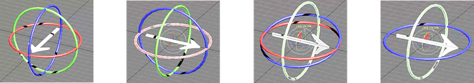

짐벌락의 문제점을 보완하기 위한 방법으로는 쿼터니언(Quaternion) 회전이 있습니다. 쿼터니언은 확장된 복소수 체계를 이용해 3차원 회전으로 표현됩니다.

- $q=w+xi+yi+zk$
  - $i : \sqrt{-1}$
  - $w$ : real part
  - $i,j,k$ : imaginary units
  - $x,y,z$ : imaginary commponents
- $q=w+v$ (w: scalar, v: vector)

오일러 각의 짐벌 락 문제를 보완하기 위해 각 축을 한꺼번에 계산하며 행렬보다 연산 속도가 빠르고 메모리 소모도 적고 최단 호(shortest arc) 보간으로 오류 발생이 적다는 특징이 있습니다. 쿼터니언 각(𝑞𝑤, 𝑞𝑥, 𝑞𝑦, 𝑞𝑥)을 오일러 각(Φ,θ, Ψ)으로 변환하면 오일러 3차원 공간과 호환되며 역도 성립됩니다.

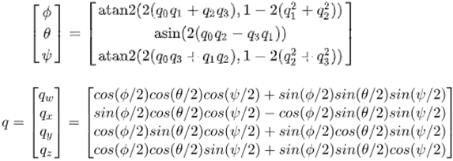

euler() 메소드를 사용하면 θ, ψ, φ의 순서대로, 즉 `yaw`, `roll`, `pitch` 의 순서대로 반환합니다. 여기서 yaw, roll, pitch는 사물의 자세를 의미하는 각도로 아래 그림과 같습니다.

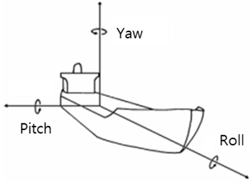

yaw는 물체가 회전하는 방향으로 z축을 중심으로 회전한 각도입니다. roll은 물체가 좌 또는 우로 기우는 방향으로 x축을 중심으로 회전한 각도이며, pitch는 물체가 앞 또는 뒤로 치솟는 방향으로 y축을 중심으로 회전한 각도를 의미합니다.

오일러 데이터를 수신할 때는 euler() 메소드를 활욯합니다. 

```python
from autocar3g.Imu import Imu
import time 

imu = Imu()

for _ in range(20):
    print(imu.euler())
    time.sleep(0.1)
```

```
[출력]
(109.6710205078125, -0.6207275390625, 7.05322265625)
(109.6710205078125, -0.6207275390625, 7.0587158203125)
…
(109.676513671875, -0.63720703125, 7.00927734375)
(109.6710205078125, -0.63720703125, 7.0037841796875)
```

쿼터니언 데이터를 수신할 때는 quat() 메소드를 활용합니다. 

```python
from autocar3g.Imu import Imu
import time 

imu = Imu()

for _ in range(20):
    print(imu.quat())
    time.sleep(0.1)
```

## 카메라

`Camera` 클래스의 `read()` 메소드를 활용하면 이미지 데이터를 받을 수 있습니다. 이미지는 인공지능 학습을 용이하게 하기 위해 사이즈를 400x274로 고정되어 있으며, OpenCV 처리가 가능하도록 Numpy 배열로 반환됩니다.

```python
from autocar3g import Camera
import cv2

cam = Camera()
cam.start()
while True:
  cv2.imshow("img", cam.read())
  if cv2.waitKey(1) & 0xFF == ord('q'):
    break
cv2.destroyAllWindows()
```


