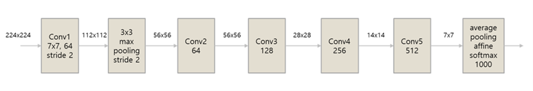
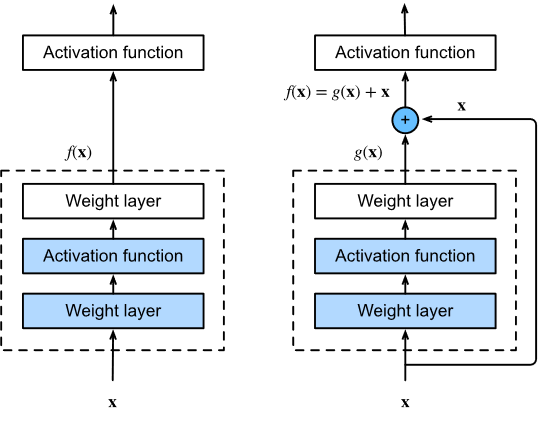
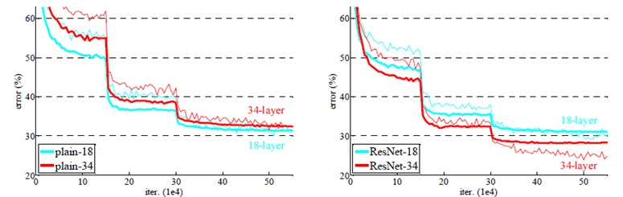
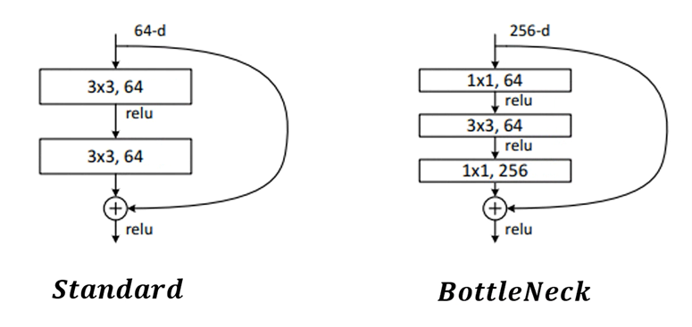

# Resnet

컨볼루션 네트워크는 1990년대 Yann LeCun에 의해 개발되었습니다. 최초의 컨볼루션 네트워크였던 LeNet은 우편번호나 숫자 등을 읽는데 사용되었습니다. 컨볼루션 네트워크의 대중화를 이끈 학자들은 Alex Krizhevsky와 Ilya Sutskever 그리고 Geoff Hinton입니다. 이들이 개발한 아키텍쳐인 AlexNet은 2012년 ImageNet 챌린지에서 1위를 했습니다. 그 외에도 ZF Net이나 GoogleLeNet등이 우승을 차지했습니다. 2014년에는 VGGNet이 네트워크의 깊이가 우수한 성능을 판가름하는 하나의 지표가 된다는 것을 증명했습니다. 하지만 네트워크의 깊이가 모델의 우수성을 보장하지는 않습니다. 가중치가 잘못된 방향으로 업데이트 되는 기울기 소실vanishing이나 폭주exploding이 발생할 수 있기 때문입니다. 하지만 ResNet은 ImageNet 챌린지에서 2014년도 우승한 GoogleNet보다 약 7배 더 깊은 152개의 레이어를 지원합니다. 잔차 블록residual block을 도입하여 연산 효율을 높이고 기울기 소실 문제를 해결했습니다. AlexNet은 8-layer, VGG는 19-layer, GooleNet은 22-layer이나 ResNet은 최대 152-layer까지 지원합니다. 

다음 이미지는 ResNet의 구조입니다. ResNet은 VGGNet을 뼈대로 하여 만들어졌습니다.

 
## 잔차 블록 
ResNet의 주요 구성요소는 2개의 컨볼루션 레이어를 하나로 묶어 사용하는 잔차블록입니다. 오차는 모집단에서 얻은 예측값과 실제값의 차라면, 잔차는 표본집단에서 얻은 예측값과 실제값의 차이입니다. 잔차 블록을 학습시키므로 전체를 학습하는 것보다 쉽게 오차를 줄여줍니다. 다음의 왼쪽 그림은 일반적인 구조를 오른쪽 그림은 잔차 구조를 보여줍니다. 입력과 출력을 더해주는 형태를 가지고 있습니다. 이를 스킵 커넥션skip connection 혹은 숏컷 커넥션short connection이라 부릅니다. 데이터가 심층 연결망을 거치면서 사라지는 구체적인 정보들을 일정 위치마다 추가함으로써, 기울기 소실 문제를 해결하고 공간 정보를 복구합니다. 떨어진 두개의 층을 연결했기 때문에 오차 역전파시 기울기가 쉽게 전파됩니다. 잔차 블록을 통과한 값과 그 전의 결과를 누적해 다음 잔차 블록의 입력으로 사용할 때, 두 결과의 shape가 같지 않으면 연산이 불가능합니다. 그럴시에는 최대 풀링 대신 stride=2인 컨볼루션 레이어를 하나 연결해 shape를 맞춰줍니다. 이를 다운 샘플링down sampling이라 부릅니다.
 

ResNet은 더 넓은 필터를 쓰고 신경망을 얕게 쌓은대신, 작은 필터를 사용하여 깊은 신경망을 구현합니다. (10×10 이미지에 7×7 필터(stride=1)를 적용하면 4x4 특성 맵 생성. 매개변수는 49개 /10×10 이미지에 3×3 필터(stride=2)를 3번 적용하면 4x4 특성 맵 생성. 매개변수는 9개씩 3번 총 27개) 또한 패딩을 이용해 이미지의 크기를 유지합니다. 특성 맵의 크기가 반으로 줄어들 때 특성 맵의 깊이를 2배로 높입니다.

###	병목 구조
병목 구조를 구현하기 위해서는 point-wise convolution을 활용합니다. point-wise convolution의 1x1사이즈의 커널을 사용하여 채널 방향으로 컨볼루션을 진행합니다. 채널 사이즈를 줄여 연산 속도를 향상시키는 방법입니다. 병목 구조는 다음과 같이 수행됩니다. 256개의 입력 채널을 첫번째 1x1 커널을 통해 64채널로 압축합니다. (1x1커널은 공간적 특징을 추출하지 못하므로 차원 축소를 위한 커널입니다.) 두번째 커널은 3x3사이즈로 공간적인 특징을 추출합니다. 세번째 커널은 1x1 사이즈로 다시금 차원을 256으로 늘리기 위해 사용됩니다. (1x1 커널을 256개 배치하면 됩니다.) 1x1 커널로 학습 가능한 매개변수의 수를 줄이는 것이 병목 구조 블록의 목표입니다. 컨볼루션에서 학습 가능한 가중치의 수는 ‘커널크기 가로 x 커널크기 세로 x 입력채널 수 x 출력 채널 수’ 입니다. 병목 블록은 표준 블록에 비해 채널 수는 4배 정도 많지만 매개변수는 3배 정도 적습니다.
 

###	ResNet 모델 구조 
224x224 크기의 입력 이미지를 Conv1에서 스트라이드가 2인 7x7 크기의 필터 64개로 특징을 추출한 후 풀링 레이어로 전달합니다. 풀링 레이어는 스트라이드 2인 3x3 최대 풀링을 수행한 후 결과를 Conv2에 전달합니다. Conv2 ~ Conv5는 3x3 크기의 개수가 다른(64, 128, 256, 512) 필터로 다수의 잔차 블록으로 특징을 추출해 어파인 레이어로 전달합니다. Conv 그룹을 통과할 때마다 피라미드 다운사인징이 발생하며, 갯수가 다른 레이어간 잔차 추가는 스트라이드 2로 맞춥니다. 컨볼루션 레이어를 통해 추출한 특징은 1개의 '평균 풀링-어파인' 레이어를 통해 1000개의 이미지로 분류됩니다.
 
