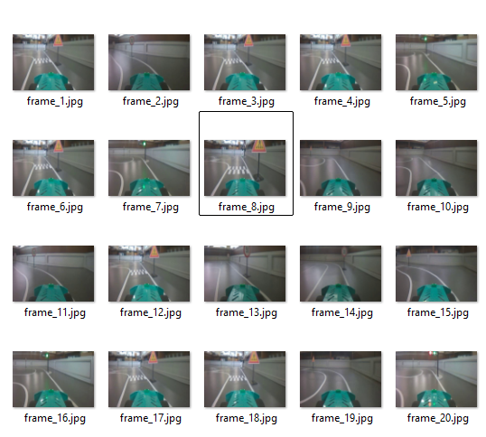
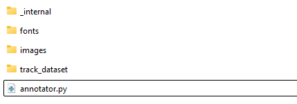
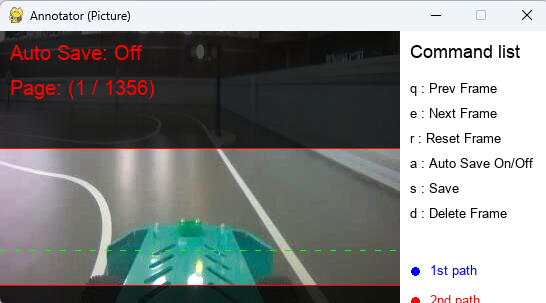
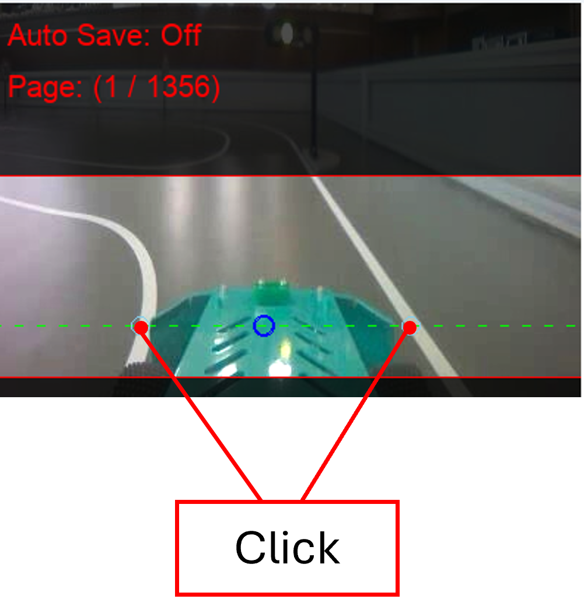
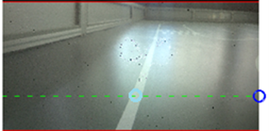
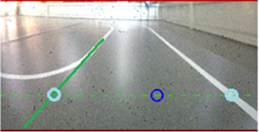
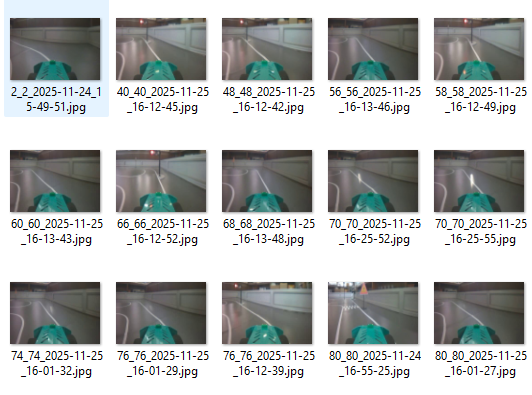

# 트랙 주행

본 챕터에서는 구성된 트랙 위에서 AutoCar가 스스로 경로를 찾아 주행할 수 있는 작업을 진행합니다. AutoCar를 사용해 데이터를 수집하고 모델을 학습 및 실행시키는 전체 인공지능 개발 과정을 진행합니다.

## 트랙 준비

실습을 진행하기에 AutoCar를 실습시킬 트랙을 구성합니다. 참고로 트랙 주행은 차선, 콘 등을 이용해 트랙을 만들고 차량이 주행할 때 발생하는 여러 상황을 수집하여 학습시킬 수 있습니다. 본 교재는 차선 인식을 기준으로 실습을 진행합니다. 참고로 차선을 그릴 때는 바닥색과 대비되는 색의 종이 테이프를 사용하면 좋습니다.

## 데이터 수집

트랙이 준비되었다면 AutoCar를 트랙 위에서 수동으로 조작하면서 학습에 사용할 영상을 녹화합니다. 아래 두 개의 코드를 동시에 실행시켜 키보드로 AutoCar를 조작하고, 카메라 영상을 녹화합니다. 

프로그램을 실행하기 전, VSCode 터미널에서 필수 패키지를 설치합니다.

```sh
pip install pynput
```

> [!Important]
> 제시된 두 프로그램은 동시에 동작되어야 합니다. 서로 다른 두개의 터미널에서 프로그램을 동작시키거나, 코드 병합 및 멀티프로세싱 등을 활용하여 실행하여 주십시오.

키보드 제어 프로그램은 w,a,s,d 네 개의 키로 차량을 조작하며 키 매핑은 아래와 같습니다. 

- w: 전진 
- a: 조향각 0.5 조정
- s: 후진
- d: 조향각 -0.5 조정


```python
from pynput import keyboard
from autocar3g.driving import Driving
import time

pressed = set()
global drv
drv = Driving()
global time_tag
time_tag = time.time()

def on_press(key):
    global drv, time_tag
    try:
        k = key.char
        if k in ("w", "a", "s", "d"):
            if k not in pressed:
                if k == "w":
                    drv.throttle = 10
                elif k == "a":
                    drv.steering = -0.5
                elif k == "s" :
                    drv.throttle = -10
                elif k == "d":
                    drv.steering = 0.5
                pressed.add(k)
    except:
        pass

def on_release(key):
    try:
        k = key.char
        if k in pressed:
            pressed.remove(k)
            if k == "w" or k == "s":
                drv.throttle = 0
            elif k == "a" or k == "d":
                drv.steering = 0
        if k == 'q':
            return False
    except:
        pass

with keyboard.Listener(on_press=on_press, on_release=on_release) as listener:
    listener.join()
```


<br>

영상 녹화 프로그램은 실행 시점부터 즉시 영상을 녹화합니다. 영상 데이터를 수집할 때, 정상적으로 주행한 영상과 약간 차선을 이탈한 영상을 8:2 비율로 구성했을 때 가장 좋은 학습 효과를 얻을 수 있었습니다.


```python
import logging
import cv2
import time
from autocar3g.camera import Camera

if __name__ == "__main__":
    cam = Camera()
    cam.start()
    fourcc = cv2.VideoWriter_fourcc(*'mp4v')
    out = cv2.VideoWriter('out.mp4', fourcc, 20.0, (400,275))
    try:
        while True:
            frame = cam.read()
            if frame is not None:
                out.write(frame)
                cv2.imshow("frame", frame)
                cv2.waitKey(1)
            time.sleep(0.01)
    except KeyboardInterrupt:
        pass
    finally:
        out.release()
        cv2.destroyAllWindows()
        cam.stop()
```


## 데이터 가공

위 과정을 통해 학습에 사용할 데이터를 수집하였습니다. 이제 이 데이터를 라벨링하여 인공지능 학습에 사용 가능하도록 가공해 보겠습니다.

### 영상 프레임 추출

아래 코드를 사용하여 위 데이터 수집 과정에서 녹화한 영상을 프레임 단위로 추출하여 데이터를 저장합니다. 데이터 저장 위치는 'track_dataset' 이며, 바로 다음 과정에서 사용됩니다. 

> [!Warning]
> 문서에 지정한 폴더 이름을 변경하지 말아주시길 바랍니다. 

```python
import cv2
import os

cap = cv2.VideoCapture("out.mp4")
os.makedirs("track_dataset", exist_ok=True)
i = 1

while True:
    ret, frame = cap.read()
    if not ret:
        break
    i += 1
    if i % 20 == 0:
        cv2.imwrite(f"track_dataset/frame_{i:05d}.jpg", frame)

cap.release()
```

코드를 실행하면 아래 사진과 같이 새로 생성된 'track_dataset' 폴더 밑에 `frame_1.jpg`, `frame_2.jpg`, ... 식으로 영상에서 프레임이 추출된 것을 확인할 수 있습니다.



### 데이터 라벨링 툴

본 교재에서는 제공되는 툴을 사용해 라벨링을 진행합니다. 아래 과정을 통해 PC에서 데이터 라벨링 툴을 설치 및 실행시킵니다.

1. VSCode 터미널에 다음 명령어를 입력하여 필수 패키지를 설치합니다.

    ```
    pip install pygame
    ```

2. 아래 주소를 통해 `annotator.zip` 파일을 다운로드받고, 압축을 해제합니다. 

- https://github.com/hanback-lab/Autocar3G/blob/main/tools/annotator.zip

3. 위 과정에서 저장된 'track_dataset'을 annotator 폴더 안에 옮깁니다.

    

4. `annotator.py` 프로그램을 실행시킵니다.

    

해당 툴은 다음 키보드 입력값을 받으며, 아래와 같이 대응되고 있습니다.

- q : 이전 프레임으로 이동
- e : 다음 프레임으로 이동
- r : 저장된 라벨링값 초기화
- a : 자동 저장. 라벨링 진행 시 즉시 저장
- s : 저장
- d : 프레임 삭제 

### 라벨링 진행

라벨링 툴을 사용하여 추출한 프레임에 라벨링을 진행합니다. 목표값은 이미지 프레임 데이터에 해당 되는 조향 목표값을 나타내게 되며, 이 값은 이미지 이름에 저장됩니다.

최소한 2000장 이상이 필요하며 정상적인 주행 상황을 비롯해 좌우측 차선에 치우친 상황, 과도한 코너링 상황, 차선 근처에 조형물 등이 있는 상황과 없는 상황, 날씨나 시간대에 따라 광량이 차이나는 상황 등 최대한 다양하고 많은 데이터를 수집해야 양질의 모델을 기대할 수 있습니다. 다만 특정 상황의 데이터가 너무 많거나 적으면 상황에 따라 적절하지 않은 결과값이 나오는 등의 문제가 발생할 수 있으므로 여러 상황의 비율을 고려하여 데이터를 수집해야 합니다.

데이터를 수집하기 위하여 차선과 제시되는 가이드라인이 중첩되는 곳을 2번 클릭하여 데이터를 레이블링 합니다. 클릭 직후에는 클릭된 위치에 비례하여 조향 목표값을 자동으로 연산하여 저장되며, 그 값은 가이드라인 위에 파란색 원으로 표시됩니다.



2개의 차선이 모두 가이드라인을 지나가지 않는 경우는 차선이 아예 보이지 않을 경우와 차선이 끊어진 경우가 있습니다. 차선이 아예 보이지 않을 경우에는 가이드라인과 차선이 중첩되는 곳을 좌클릭한 후, 안 보이는 차선 방향으로 화면의 끝을 좌클릭한다. 도중에 차선이 끊어졌을 경우 가상의 선을 그려 가상의 선과 차선이 가로지르는 곳과 차선과 가이드라인이 가로지르는 곳을 좌클릭합니다.



<br>



이미 저장된 데이터라도 다시 라벨링을 진행하시어 목표값을 업데이트할 수 있습니다.

라벨링이 완료되면 아래와 같이 파일명이 모두 학습에 사용될 수 있도록 변경된 것을 확인할 수 있습니다.



## 모델 학습

위 과정에서 라벨링한 데이터들을 바탕으로 학습을 진행해보겠습니다. 

> [!Note]
> 학습 환경은 Colab, 사용자 PC 등 원하는 환경에서 진행합니다. 본 교재에서는 Colab을 기반으로 진행하겠습니다.

학습을 실행하기 전, 가공된 데이터가 저장된 'track_dataset' 폴더를 압축 후 Google Drive에 업로드합니다.

이 후 Colab에 접속한 뒤, 아래 코드를 실행하여 라이브러리 포함 및 google drive와 연결합니다.

```python
from google.colab import drive
from google.colab.patches import cv2_imshow

import tensorflow as tf
import keras
from tensorflow.keras import *
from tensorflow.keras.models import *
from tensorflow.keras.losses import *
from tensorflow.keras.layers import *
from tensorflow.keras.optimizers import *
from tensorflow.keras.callbacks import *
from tensorflow.keras.utils import *
from tensorflow.keras.models import load_model
from tensorflow.keras.layers import Activation
import tensorflow.keras.backend as K

import glob, os, cv2
import numpy as np
from tqdm import tqdm

drive.mount('/content/drive')
```

아래 코드들로 압축 해제 후, 학습을 위해 사용할 데이터셋을 지정합니다. label 리스트는 출력 데이터의 리스트이며, img 리스트는 입력 데이터의 리스트입니다. 입력 데이터는 앞에서 수집한 카메라 이미지이며, 배경 변화 등에 덜 민감하게 반응하기 위해 이미지의 일부분을 잘라 트랙 부분의 1/3 이미지만 사용합니다. 데이터 수집 시 400x274 사이즈를 사용하였으며, 이미지 가로만 사용하기에 값이 0과 1 사이에 위치하도록 label을 400으로 나눠줍니다.

```python
PATH = '/content/tmp'
ZIP_PATH = '/content/drive/MyDrive/track_dataset.zip'

os.makedirs(PATH, exist_ok=True)
!unzip $ZIP_PATH -d /content/tmp/ > /dev/null

file_list = glob.glob('/content/tmp/*.jpg')

label=[]
img=[]

for file in tqdm(file_list):
  try:
    label.append([float(file.split('/')[-1].split('_')[0]), float(file.split('/')[-1].split('_')[1])])
  except:
    pass

  X = cv2.imread(file)
  img.append(X[120:270, :])

input = label
label=np.array(input)
img=np.array(img)

label=label/400 
label.shape, img.shape 
```

기존의 합성곱 신경망 연구에서는 망이 더 깊어질수록 즉, 더 많은 수의 레이어를 사용할수록 성능이 좋아질 것으로 여겨졌습니다. 하지만 실제로는 20층 이상부터 성능이 낮아지는 Degradation 문제가 발생했고, ResNet 모델은 이 문제를 해결하기 위해 고안되었습니다. 여기서는 keras.layers를 활용하여 ResNet 모델을 구현하였습니다. 다음 ResNet 모델은 경량화 모델로 일반적인 ResNet과는 형태가 다릅니다. 

먼저 첫번째 레이어는 Input 레이어로, 입력 데이터의 형태를 설정합니다. 다음의 Conv2D 레이어는 컨볼루션 레이어로, 필터의 개수, 커널의 크기, 스트라이드, 패딩, 활성화함수를 파라미터로 설정합니다. 필터의 개수는 많을수록 많은 특징을 추출할 수 있지만, 학습 속도가 느리고 과적합 문제가 발생할 수 있습니다. 스트라이드는 입력 데이터에 필터를 적용할 때 이동할 간격을 조절할 때 사용하며, 입력 데이터가 너무 큰 경우에는 연산량을 줄이기 위해 사용합니다. 패딩은 합성곱 연산을 수행하기 전에 입력 데이터 주변을 특정값으로 채워 늘리는 것으로 ‘valid’ 혹은 ‘same’ 중 하나를 선택할 수 있습니다. ‘same’을 선택하면 자동으로 패딩을 채워 인풋 텐서와 아웃풋 텐서의 사이즈를 고정합니다. 여기서 사용되는 활성화함수는 Swish로 ReLU를 대체하기 위해 구글이 고안한 함수입니다. 깊은 레이어를 학습시킬 때 Relu보다 더 뛰어난 성능을 보인다고 합니다. 

BatchNormalization 레이어는 학습 과정에서 각 배치 단위별로 데이터가 다양한 분포를 가지더라도 각 배치별로 평균과 분산을 이용해 정규화하는 역할을 합니다. 해당 레이어를 사용하면 학습 속도가 개선되고, 가중치 초깃값 선택의 의존성이 적어지며, 과적합 위험을 줄일 수 있습니다. 
MaxPooling 레이어는 여러 pooling 기법 중 max pooling을 수행하는 레이어로, max pooling은 정해진 크기 안에서 가장 큰 값만 뽑아 모아 놓는 것을 뜻합니다. 이 레이어의 파라미터 중 pool_size는 pooling에 사용할 필터의 크기, strides는 pooling에 사용할 필터의 이동 간격을 의미합니다. Add 레이어는 같은 형태의 레이어 리스트를 입력으로 받아 동일한 형태의 레이어로 반환합니다. 
Flatten 레이어는 추출된 주요 특징을 전결합층에 전달하기 위해 1차원 형태로 바꿔주는 역할을 합니다. 
Dense 레이어는 입출력을 모두 연결해주는 레이어로 파라미터를 통해 출력 뉴런의 수와 활성화함수를 지정합니다. 트랙 주행 모델의 결과값은 2개의 x 좌표이므로 마지막 Dense 레이어의 출력 뉴런 수는 2로 설정해야 합니다. 
keras.models.Model의 파라미터 중 inputs는 입력 레이어, outputs는 출력 레이어로 지정하여 앞에서 명시한 레이어를 연결합니다.


```python
input1 = keras.layers.Input(shape=(150, 400, 3,))
conv1 = keras.layers.Conv2D(filters=16, kernel_size=(3, 3), strides= (2, 2), padding="same", activation="swish")(input1)
norm1 = keras.layers.BatchNormalization()(conv1)
pool1 = keras.layers.MaxPooling2D(pool_size=(3, 3), strides=(2, 2)) (norm1)
conv2 = keras.layers.Conv2D(filters=32, kernel_size=(3, 3), strides= (2, 2), padding="same", activation="swish")(pool1)
norm2 = keras.layers.BatchNormalization()(conv2)
conv3 = keras.layers.Conv2D(filters=32, kernel_size=(3, 3), strides= (1, 1), padding="same", activation="swish")(norm2)
norm3 = keras.layers.BatchNormalization()(conv3)
add1 = keras.layers.Add()([norm2, norm3])
conv4 = keras.layers.Conv2D(filters=64, kernel_size=(3, 3), strides= (2, 2), padding="same", activation="swish")(add1)
norm4 = keras.layers.BatchNormalization()(conv4)
conv5 = keras.layers.Conv2D(filters=64, kernel_size=(3, 3), strides= (1, 1), padding="same", activation="swish")(norm4)
norm5 = keras.layers.BatchNormalization()(conv5)
add2 = keras.layers.Add()([norm4, norm5])
conv6 = keras.layers.Conv2D(filters=128, kernel_size=(3, 3), strides= (2, 2), padding="same", activation="swish")(add2)
norm6 = keras.layers.BatchNormalization()(conv6)
conv7 = keras.layers.Conv2D(filters=128, kernel_size=(3, 3), strides= (1, 1), padding="same", activation="swish")(norm6)
norm7 = keras.layers.BatchNormalization()(conv7)
add3 = keras.layers.Add()([norm6, norm7])
conv8 = keras.layers.Conv2D(filters=256, kernel_size=(3, 3), strides= (2, 2), padding="same", activation="swish")(add3)
norm7 = keras.layers.BatchNormalization()(conv8)
conv9 = keras.layers.Conv2D(filters=512, kernel_size=(3, 3), strides= (2, 2), padding="same", activation="swish")(norm7)
norm8 = keras.layers.BatchNormalization()(conv9)
flat1 = keras.layers.Flatten()(norm8)
dense1 = keras.layers.Dense(128, activation="swish")(flat1)
norm9 = keras.layers.BatchNormalization()(dense1)
dense2 = keras.layers.Dense(64, activation="swish")(norm9)
norm10 = keras.layers.BatchNormalization()(dense2)
dense3 = keras.layers.Dense(64, activation="swish")(norm10)
norm11 = keras.layers.BatchNormalization()(dense3)
dense4 = keras.layers.Dense(2, activation="sigmoid")(norm11)
model = keras.models.Model(inputs=input1, outputs=dense4)
```

최적화 함수를 Adam으로, 손실 함수는 MSE(평균 제곱 오차)로 하여 컴파일한 뒤, 학습을 진행합니다. 

keras.callbacks 라이브러리에서 EarlyStopping 클래스를 불러와 특정 조건에서 학습을 종료하도록 설정하여 과적합과 과소적합을 방지할 수 있습니다. monitor 파라미터를 ‘val_loss’로 설정하면 학습할 때 검증 데이터의 loss를 확인하기 때문에 fit() 메소드에서 validation_split 파라미터에 값을 입력하여 입력 데이터의 일부를 검증 데이터로 사용하거나 validation_dataset 파라미터에 사용할 검증 데이터셋을 따로 만들어 사용할 필요가 있습니다. 여기서는 validation_split 파라미터에 0.1을 입력하여 입력 데이터의 일부를 검증에 사용합니다. EarlyStopping의 파라미터 중 mode는 ‘min’으로 설정하여 검증 데이터의 loss값이 최소일 때 조기 종료하도록 합니다. patience 파라미터를 20으로 설정하여 20번 학습하기 이전에 학습이 종료되는 것을 방지하며, min_delta 파라미터에는 모델이 개선된 것으로 간주하기 위한 최소한의 변화량을 입력합니다.

학습 시 위에서 생성한 img와 label을 각각 x와 y 파라미터로 사용합니다. EarlyStopping을 사용하기 위해 callbacks 파라미터에 위에서 생성한 es를 입력합니다. 
학습이 완료되면 save() 메소드를 활용하여 모델을 저장할 수 있습니다.


```python3
adam = keras.optimizers.Adam(learning_rate=1e-3)
model.compile(optimizer=adam, loss="mse")

es = keras.callbacks.EarlyStopping(monitor='val_loss', mode='min', patience=20, min_delta=1e-4)

model.fit(x=img, y=label, epochs=1000, batch_size=32, validation_split=0.1, callbacks=es)
```

아래 코드로 모델을 저장한 후, 사용자 환경에 저장합니다.

```python
model.save('Track_Model.h5')
```

## 모델 평가

카메라와 Driving 객체를 생성한 다음, 위에서 만든 ResNet 모델을 불러옵니다. 스피드는 10에서 30사이의 값이 적절합니다. 모델의 결과값을 ret_tf라는 변수에 저장합니다. ResNet 모델의 결과값 중 ‘x’값을 활용해 steer 변수를 설정하는데, 이는 앞에서 직진 시의 목표 지점을 향해서 움직일 때의 조향값을 의미합니다. steer 값은 상황에 따라 미세하게 조정할 수 있습니다.

```python
from autocar3g import AI, Camera
from autocar3g.driving import Driving
import cv2, time

cam = Camera()
cam.start() 

car = Driving()
throttle = 10

TF = AI.Track_Follow_TF(cam)
TF.load_model("Track_Model.h5")

while True:
    try:
        car.throttle = throttle
        if value is not None:
            steer=(ret_tf['x']-0.5)*2
            car.steering=steer 
    except KeyboardInterrupt:
        car.throttle = 0
        car.steering = 0 
        break
```

만약 동작 수행이 이상하다면 특정 구간의 데이터를 더 보강하여 다시 학습을 진행한 후 확인해봅니다.