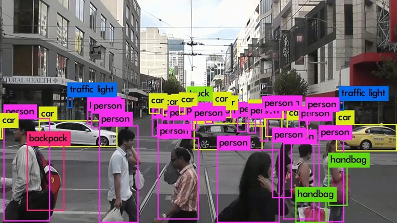
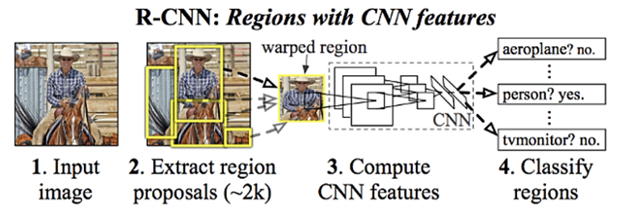
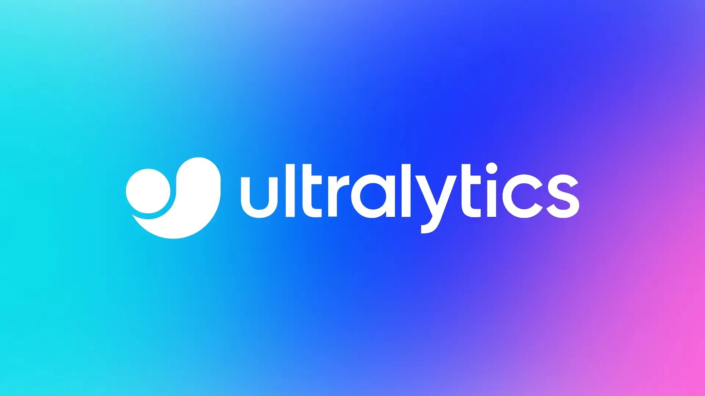

# YOLO

## 객체 탐지

객체 탐지는 이미지에서 물체를 분류한 후 정확한 위치를 경계 박스(이하 BBox)로 표시하는 것입니다. 영상처리 알고리즘 기반에서 딥러닝으로 변화했습니다.

### 투샷 감지

관심 영역을 슬라이딩 윈도우로 이동하면서 선택적 검색 알고리즘을 수행한 후 합성곱 신경망을 적용합니다. 선택적 검색 알고리즘을 통해 지역을 제안하고, 이를 합성곱 신경망에 전달해 클래스 분류 및 BBox를 뽑아냅니다. 이미지 내의 물체 크기는 랜덤하며 일부 객체는 다른 객체보다 경계가 덜 명확하므로 모든 객체의 크기 고려합니다. 영역들을 그룹화하는 최적화된 단일 전략은 없으므로 색상, 텍스쳐, 크기 등 다양한 조건을 함께 고려해야 합니다. 지역 제안과 객체 탐지 신경망을 분리하여 정확도는 높지만 엄청난 연산량을 요구한다는 단점이 있습니다. 

R-CNN 계열(R-CNN, Faster R-CNN, R-FCN, Mask R-CNN 등)의 합성곱 신경망이 투샷 탐지 신경망입니다. 걔 중 Faster R-CNN은 지역 제안region proposals network과 객체 탐지를 같은 합성곱 신경망에서 처리해 속도를 향상시킵니다.

### 원샷 감지

지역 제안 단계를 건너뛰고 최종 현지화와 객체 예측을 한 번에 산출합니다. 정확도는 조금 떨어지지만 처리 속도는 매우 빠르다는 장점이 있습니다.

후보 영역 추천은 세그먼테이션과 철저한 검색을 결합한 것입니다. 세그먼테이션은 이미지의 구조를 활용하여 샘플링 프로세스를 안내합니다. 철저한 검색은 모든 객체의 위치를 찾습니다. SSD, RetinaNet, YOLO 합성곱 신경망 등이 있습니다.

## YOLO

YOLO는 흔히 일상에서 사용되는 You Only Live Once 가 아니라 You Only Look Once의 줄임말로 빠른 속도로 물체를 탐지하기 위해 만들어진 모델입니다. 

2016년에 YOLO가 등장하기 이전에는 일단 물체가 있을 만한 영역을 우선 뽑아낸 다음, 각 영역을 합성곱 신경망 CNN을 통해 분류와 지역화를 수행하는 2-stage Detector 방식만을 사용했습니다. 이 방식으로 작동되는 모델 중 가장 빠른 속도를 제공하는 Faster R-CNN 조차도 7fps의 속도를 보여 실시간으로 사용하기엔 어려웠습니다. 반면에 YOLO는 영역을 뽑아내는 단계 없이 바로 전체 이미지에 대해 합성곱 신경망을 통해 분류 및 지역화를 수행하는 1-stage Detector 방식으로 작동합니다. 속도는 45fps로 Faster R-CNN 보다 약 6배 향상되었음에도 정확도는 73.2mAP에서 63.4mAP로 크게 떨어지지 않았습니다. 여기서 mAP는 mean Average Precision의 줄임말로 물체 탐지 분야에서 성능을 평가할 때 사용하는 수치입니다. 

첫 번째 버전의 YOLO는 빠른 속도로 물체를 탐지할 수 있지만 크기가 작은 물체를 잘 탐지해내지 못하는 문제가 있었습니다. 이 문제는 YOLOv2에서 배치 정규화를 도입하고 GoogleNet 대신 DarkNet-19를 사용하는 등의 방법을 통해 개선되었습니다. 그리고 YOLOv2까지는 224x224 크기의 이미지를 사용했던 것과 달리 YOLOv3에서는 더 큰 크기의 300x300 이미지를 사용해 22ms만에 51.5mAP의 정확도로 물체를 탐지합니다. 

YOLOv3 이후에 나온 YOLOv4는 이미지의 일부를 잘라내거나 다른 이미지의 일부를 갖다 붙이는 등의 작업을 통해 데이터셋의 과적합을 막고 더 효과적으로 데이터를 활용할 수 있도록 학습되었습니다. 혼동하기 쉬운 데이터를 모아 한 번 더 학습하여 잘못된 예측을 하는 오류에 강해지도록 만들었습니다. 이외에도 LeakyReLU, PReLU, SeLU, Mish 등의 활성화 함수를 사용하는 등 여러 방법을 적용하여 성능을 개선했습니다. 

현재 시점(2025년)에서 Yolo는 ultralytics 기반의 모델이 주로 쓰여지고 있습니다. Darknet 기반의 YOLOv4에서 PyTorch 기반 Ultralytics 계열(YOLOv5~v8)로의 전환은, 객체 탐지 모델이 복잡한 구조적 기법에 의존하던 시대에서 간결한 구조와 학습 과정 중심의 최적화로 이동했다는 것을 의미합니다. PyTorch의 자동 미분 환경과 모듈화를 바탕으로, 모델은 더 가벼운 backbone과 효율적인 neck 구조를 사용하면서도, anchor-free 예측과 새로운 손실 함수(DFL, Varifocal Loss 등)를 통해 더 높은 표현 능력을 확보합니다. 이 과정에서 일반화 성능은 모델 구조의 복잡성보다 학습 전략·손실 설계·증강 정책의 자동화에 의해 달성되는 방향으로 바뀌었습니다. 또한 모델은 단일 구조에 고정되지 않고, 다양한 크기와 형태의 변형을 쉽게 생성할 수 있어 실험과 배포의 유연성이 극적으로 높아졌습니다.  결과적으로 Ultralytics 계열은 구조적 트릭보다 효율, 확장성, 자동화된 일반화 능력을 핵심 원리로 삼는 현대적 객체 탐지 패러다임을 구축하게 되었습니다.

