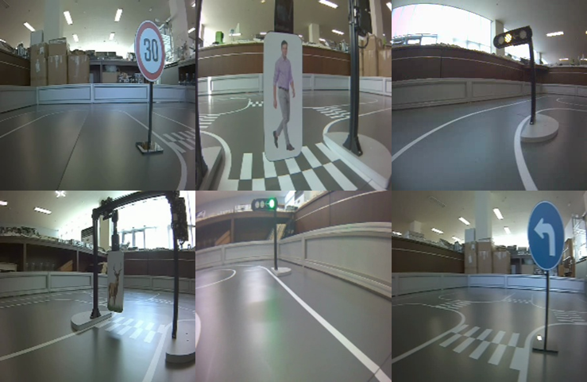
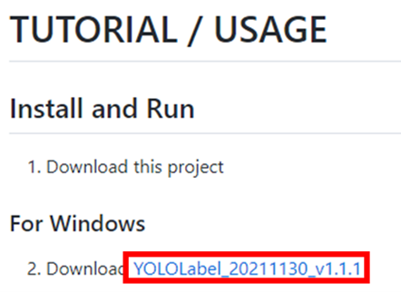
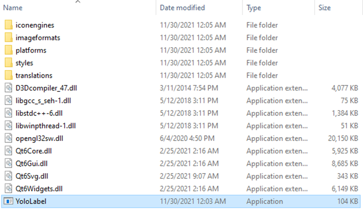
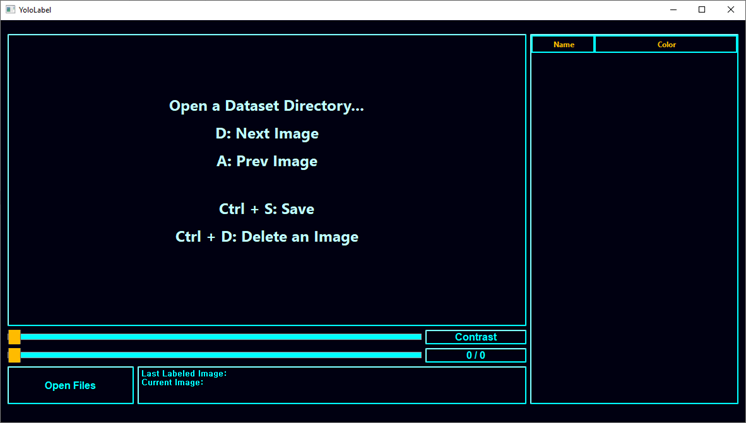
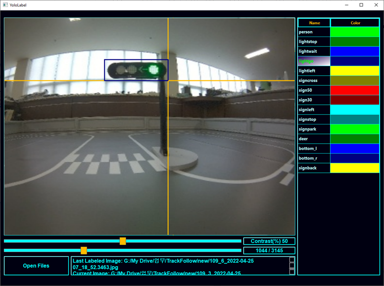
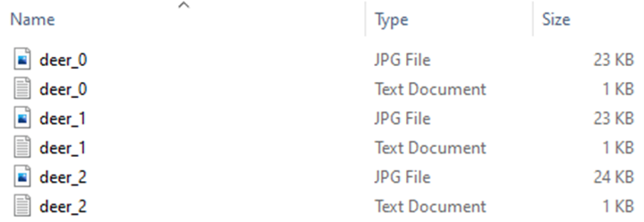

# Object Detect

본 챕터에서는 주어진 객체들을 학습하고 이에 알맞는 동작을 AutoCar가 스스로 수행하는 작업을 진행합니다. 본 챕터에서는 Ultralytics Yolov8 모델 학습을 기반으로 합니다. 

## 데이터 수집

Yolov8 모델을 생성하기 위해 제일 먼저 장비 등을 활용하여 탐지할 객체들의 데이터를 수집합니다. 클래스 혹은 라벨당 최소 150~200장의 데이터를 수집하는 것이 좋습니다.



데이터 수집 시 아래 그림과 같이 배경, 물체의 각도, 물체와 장비 간의 거리, 조명 등 여러 요소를 고려하여 최대한 다양한 환경에서 수집해야 합니다.

수집한 물체의 데이터셋을 물체의 목록 즉, 데이터셋의 클래스를 명시하는 ‘classes.txt’ 파일을 생성합니다. 한 예시로, 모델을 통해 사람, 사슴, 신호등, 횡단보도 표지판, 속도제한 표지판, 좌회전 표지판, 정지 표지판을 탐지하는 경우 ‘obj.names’ 파일에 아래와 같이 데이터셋의 클래스를 명시하여 저장합니다. 

```
signs50
signs30
crosswalk
outbreak
trafficsign_green
trafficsign_red
trafficsign_yellow
trafficsign_left
```

## 데이터 가공

### 라벨링 툴 설치

여러 오픈소스 프로젝트 중 하나를 선택하여 GUI 프로그램으로 손쉽게 라벨링할 수 있습니다. 대표적인 오픈소스 프로젝트는 아래와 같습니다.

- Yolo mark (https://github.com/AlexeyAB/Yolo_mark)
- CVAT(https://github.com/openvinotoolkit/cvat)
- BBox Label Tool (https://github.com/puzzledqs/BBox-Label-Tool)
- labelImg(https://github.com/tzutalin/labelImg)
- Yolo Label(https://github.com/developer0hye/Yolo_Label) 

여기서는 Yolo Label을 사용하겠습니다. 이미지 데이터셋과 ‘classes.txt’ 파일을 Yolo Label 페이지에 접속하여 TUTORIAL / USAGE 아래에서 파일을 다운로드합니다. 파일의 버전이나 레이아웃 혹은 프로그램 사용 방법은 달라질 수 있습니다.



다운로드한 Yolo Label 프로그램 압축 파일의 압축을 해제한 뒤 YoloLabel 프로그램을 실행시킵니다.



프로그램을 실행한 뒤 좌측 하단의 ‘Open Files’를 클릭하여 Step 1에서는 데이터셋이 있는 폴더를 선택해주고, Step 2에서는 라벨 리스트(classes.txt)를 오픈해줍니다. 



불러온 이미지에서 물체의 위치를 표현하는 박스를 그리기 전에 해당 물체의 종류를 선택해야 합니다. 프로그램 우측에서 물체의 종류를 클릭하거나 키보드의 ‘w’와 ‘s’를 눌러 물체의 종류 혹은 클래스를 선택할 수 있습니다. 그 후 물체의 좌측 상단을 한번 클릭한 후 우측 하단을 클릭하면 물체 주변에 박스가 그려지는 것을 확인할 수 있습니다. 박스의 색깔은 선택한 클래스의 색과 동일합니다. 만약 좌표나 클래스를 잘못 지정했다면 해당 박스를 우클릭하여 취소할 수 있습니다. 프로그램 하단의 Contrast 바를 이용하여 이미지의 대비를 변경할 수도 있습니다. 다음 이미지로 넘어가기 위해서는 키보드의 ‘d’를 누르고, 이전의 이미지를 다시 확인해야 할 때는 키보드의 ‘a’를 누르면 됩니다.



이렇게 모든 이미지의 라벨링을 완료했다면 PC의 object_dataset 폴더에 이미지와 txt 파일이 같이 생성된 것을 확인할 수 있습니다.



## 모델 학습

라벨링까지 완료되었다면 본격적으로 모델을 학습해봅니다. 학습 환경은 Colab, 사용자 PC 모두 무관합니다.

### 라벨링 파일 분류

모델을 학습하기 전, 학습에 사용할 데이터와 검증할 때 사용할 데이터를 분리시켜주어야 합니다. 아래 파일 트리에 맞춰서 데이터들을 분류합니다. 학습과 검증의 데이터 비율은 각각 8:2 정도가 양호합니다.

```
datasets
|
|--- train
|     |
|     |--- images : 이미지
|     |--- labels : 라벨링 데이터 (.txt)
|
|--- val
|     |
|     |--- images : 이미지
|     |--- labels : 라벨링 데이터 (.txt)
|
|--- data.yaml
```

### data.yaml

`data.yaml` 파일이란 학습/검증 데이터의 위치 및 라벨들의 리스트들을 명시해두는 데이터 파일입니다. 일종의 길잡이 역할이기에 반드시 필요합니다. 

아래 예시와 같이 작성할 수 있습니다.

```yaml
path: dataset

train: train/images
val: val/images

names:
  0: signs50
  1: signs30
  2: crosswalk
  3: outbreak
  4: trafficsign_green
  5: trafficsign_red
  6: trafficsign_yellow
  7: trafficsign_left
```

### 학습 진행

명령 프롬프트 및 터미널에 다음 명령어를 입력합니다.

```sh
yolo detect train model=yolov8n.pt data=data.yaml epochs=100 imgsz=640 batch=16
```

학습이 완료된 후, `runs/detect/train/weights/` 경로에 학습된 모델을 확인할 수 있습니다. `best.pt`는 가장 추론 성능이 좋은 모델이고, `last.pt`는 가장 마지막으로 학습된 모델을 의미합니다.

## 모델 평가

카메라 객체를 생성한 다음, 위에서 만든 Yolo 모델을 불러옵니다. Object_Follow 클래스의 `detect()` 함수를 통해 실시간 추론 결과 확인이 가능하며, `boxes_image` 변수를 통해서 추론 결과 이미지를 확인할 수 있습니다.

```python
from autocar3g.camera import Camera
from autocar3g.AI import Object_Follow
import cv2

cam = Camera()
cam.start()
of = Object_Follow(camera=cam)
of.load_model("best.pt")

try:
    while True:
        result = of.detect()
        print(result)
        cv2.imshow("img", of.boxes_image)
        cv2.waitKey(1)
except KeyboardInterrupt:
    pass
finally:
    cv2.destroyAllWindows()
```

만약 동작 수행이 이상하다면 특정 구간의 데이터를 더 보강하여 다시 학습을 진행한 후 확인해봅니다.